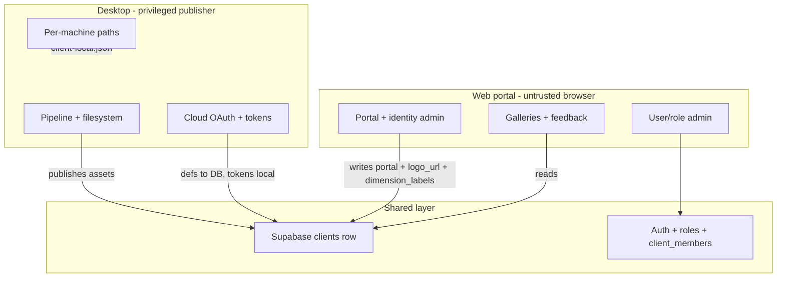

# Platform strategy: divide by capability, not duplicate

## The short answer

**Do not aim for duplicate functionality.** Aim for **complementary surfaces** where each platform owns what only it can do well, and **one canonical admin UI per field group** in Supabase.

Duplicating client CRUD on both web and desktop creates maintenance cost, permission drift, and operator confusion — without adding real capability. Your codebase already moved in the right direction with [DB-first client management (2026-07-12)](docs/pages/desktop/authentication-plan.mdx); the remaining mismatch is **unfinished consolidation**, not a wrong architecture.

---

## Guiding principle




| Question                | Answer                                                    |
| ----------------------- | --------------------------------------------------------- |
| Duplicate everything?   | **No** — only duplicate *read* surfaces and *auth entry*  |
| Strictly divide?        | **Yes** — by **capability boundary**, not arbitrarily     |
| Single source of truth? | **Yes** — one writer per field group; DB wins on conflict |


**Duplicate when it helps operators:**

- Sign-in (same Supabase project, same roles)
- Client switcher (both need to pick a client)
- Read-only display of name/accent/branding

**Do not duplicate:**

- Client create/edit for the same DB columns
- Pipeline controls, folder pickers, cloud OAuth
- User/role administration (web only)

---

## Glossary: what "infra" means here

In this plan, **infra** (short for *infrastructure config*) means the **server-side storage setup** that publishing depends on — not portal branding, not machine-local paths.


| Term                      | Fields                                                         | What it is                                                                           |
| ------------------------- | -------------------------------------------------------------- | ------------------------------------------------------------------------------------ |
| **Portal**                | `slug`, `portal_bg`, `domain_whitelist`, `website`, `initials` | How the client appears and who can sign in to the web gallery                        |
| **Storage config**        | `R2_BUCKET`, `R2_PUBLIC_DOMAIN` (environment secrets)          | One bucket + CDN domain per Supabase project / environment tier — **not per client** |
| **Branding (CDN-hosted)** | `logo_url`, `accent`                                           | Per-client visual identity; logo is a public CDN URL under `branding/{client_id}/`   |
| **Local-only**            | folder paths, OAuth tokens                                     | Per-machine operational config in `client-local.json`                                |


"Infra" / storage config is **environment-scoped**: local, staging, and production each have their own Supabase project and therefore their own R2 bucket + public domain. New clients inherit storage automatically — no bucket field on the client row.

---

## Current state: what causes the mismatch

Both apps write to `clients`, but different columns and with different permission enforcement:


| Field group       | Web ([AdminLandingPage.tsx](web/apps/client-hub/src/features/admin/AdminLandingPage.tsx)) | Desktop ([ClientPickerModal.tsx](desktop/src/features/clients/ClientPickerModal.tsx)) |
| ----------------- | ----------------------------------------------------------------------------------------- | ------------------------------------------------------------------------------------- |
| Identity          | `name`, `initials`, `slug`                                                                | `name`                                                                                |
| Branding          | `accent`, `logo_url` (URL text field), `portal_bg`, `website`                             | `accent`, local `logoDataUrl` (base64 in `client-local.json`)                         |
| Portal access     | `domain_whitelist`                                                                        | —                                                                                     |
| CDN / storage     | — (environment-level via edge function secrets)                                           | `r2_bucket`, `r2_public_domain` on client row (**to be removed**)                     |
| Cloud export defs | —                                                                                         | `cloud_destinations` (defs in DB, tokens local)                                       |
| Machine paths     | —                                                                                         | `sourceFolder`, `vaultFolder`, etc. in `client-local.json`                            |


**Overlap today (the actual problem):** `name` and `accent` are editable in **both** UIs. Everything else is already partitioned — it just *feels* messy because there are two partial admin forms.

**Secondary issues:**

- Web UI exposes client edit to editors; RLS allows only admins ([admin.mdx](docs/pages/web-portal/admin.mdx))
- No shared client types between [asset-library/types.ts](web/packages/asset-library/src/types.ts) and [desktop/domain/client.ts](desktop/src/domain/client.ts)
- Orphaned [ClientsView.tsx](web/apps/client-hub/src/features/clients/ClientsView.tsx) duplicates AdminLandingPage
- [database.types.ts](web/apps/client-hub/src/lib/database.types.ts) lags migrations (`r2_*`, `cloud_destinations`, `client_members`)

---

## Recommended field ownership (target state)

### Tier 1 — Web admin (DB identity + portal + branding + taxonomy labels)

Managed at `/` in [AdminLandingPage.tsx](web/apps/client-hub/src/features/admin/AdminLandingPage.tsx), **admin role only** (UI must match RLS):

- `name`, `initials`, `slug`, `accent`
- `logo_url` — **always a CDN URL** (see Logo policy below)
- `website`, `portal_bg`, `domain_whitelist`
- `dimension_labels` — per-client display names for entity/angle/format (admin-only; see Phase E)
- `client_members` assignment (covered in Phase 0)

**Not on the client row:** `r2_bucket`, `r2_public_domain` — these move to **environment config** (see Storage policy below).

#### Logo policy: always online, always CDN

The logo must **never** live only on one operator's machine. One canonical file, one public URL, readable by web portal, desktop, and external embeds.

```text
Upload (web admin)  →  R2 object at branding/{client_id}/logo.{ext}
Public URL stored   →  clients.logo_url = https://{r2_public_domain}/branding/{client_id}/logo.{ext}
Desktop + portal    →  read logo_url from DB; no local copy
```

**Upload mechanism (new):** extend the Control API with a branding upload path — e.g. a new `r2-branding-grant` edge function (or a `purpose: "branding"` flag on `r2-grant`) that:

1. Authenticates admin + client scope (same auth chain as `r2-grant`)
2. Returns a short-lived presigned PUT URL scoped to `branding/{client_id}/*`
3. Web admin uploads the image, then writes the resulting public URL to `logo_url`

Replace the current free-text "Logo URL" field with a **file picker + upload** flow; keep an optional advanced override to paste a URL manually (for clients hosted on their own CDN).

**Retire desktop `logoDataUrl`:**

- Remove logo file picker from [ClientPickerModal.tsx](desktop/src/features/clients/ClientPickerModal.tsx)
- Remove `logoDataUrl` from [client-local.json](desktop/src/services/clientService.ts) slice and [Client](desktop/src/domain/client.ts) type
- Desktop displays logo via `logo_url` fetched with the DB client row (same as web portal)
- One-time migration: existing `logoDataUrl` values in local config can be uploaded to R2 via a script or manual web re-upload; export bundles stop carrying logo data

#### Storage policy: environment-level bucket + CDN (not per client)

**Yes, this makes sense.** A Supabase project already *is* an environment (local / staging / production). Bucket and public domain should be configured once per project — the same way `CF_API_TOKEN` and Supabase URL are today — not repeated on every client row.

```text
Today (wrong):     clients.r2_bucket + clients.r2_public_domain  →  per client
Target (right):    R2_BUCKET + R2_PUBLIC_DOMAIN edge secrets    →  per environment
                   client_id scopes object prefixes within bucket
```


| Why environment-level          | Detail                                                            |
| ------------------------------ | ----------------------------------------------------------------- |
| Matches mental model           | Production = one CDN; staging = one CDN; local = one CDN          |
| Simpler onboarding             | New client needs no storage fields — publish works immediately    |
| Fewer misconfigurations        | No bucket/domain mismatch between clients in the same environment |
| Aligns with `r2-grant` secrets | `CF_API_TOKEN`, `CF_ACCOUNT_ID` are already per-environment       |


**Per-client isolation within a shared bucket** — object keys gain a `client_id` prefix (today keys are `thumbnails/{stableId}/…` with no client scope; `stable_id` is only collision-checked per client):

```text
branding/{client_id}/logo.png
thumbnails/{client_id}/{stable_id}/{child_id}.webp
originals/{client_id}/{stable_id}/{child_id}.ext
```

`r2-grant` changes:

1. Read `R2_BUCKET` + `R2_PUBLIC_DOMAIN` from edge function env vars (not `clients` row)
2. Still authorize by `client_id` + role + `client_members`
3. Scope temporary credentials to `{client_id}/*` prefix only

**Migration:**

1. Add `R2_BUCKET`, `R2_PUBLIC_DOMAIN` to edge function secrets (alongside existing CF secrets)
2. Update [r2-grant/index.ts](supabase/functions/r2-grant/index.ts) to use env vars + client prefix scoping
3. Update [pipelineService.ts](desktop/src/services/pipelineService.ts) object key builders
4. Migration: drop `clients.r2_bucket`, `clients.r2_public_domain` columns
5. Remove R2 fields from desktop [ClientPickerModal.tsx](desktop/src/features/clients/ClientPickerModal.tsx) and `updateDbClient`
6. Re-upload or rewrite existing CDN keys if prefix changes (one-time ops task per environment)

**Where admins configure storage:** ops/deployment docs + `supabase secrets set` per environment — not the web client drawer. Optional future: environment settings page for super-admins only.

### Tier 2 — Desktop only (native / machine-bound)

Managed in desktop Settings / Pipeline / Cloud views:

- Folder paths (`sourceFolder`, `vaultFolder`, `targetFolder`) → `client-local.json`
- Cloud destination **definitions** + OAuth **tokens** (tokens never leave the machine)
- Vocabulary, pipeline run, export/import bundles
- Environment connection (Supabase URL + anon key)

### Tier 3 — System / scripts only

- `identity_migrated` (migration script)
- `id`, `created_at`

### Desktop client picker becomes

- **Select** client + environment
- **Read-only** summary of portal fields (name, accent, slug, logo from CDN) — no storage config
- **Link** "Edit client in portal" (opens web admin)
- **Create client** — either remove from desktop entirely, or reduce to a minimal "request" that opens web (prefer removal)

---

## What stays desktop-only forever

These are **hard capability boundaries**, not product choices:


| Capability                            | Why not web                                               |
| ------------------------------------- | --------------------------------------------------------- |
| Run pipeline                          | Native filesystem, cwebp, LibreOffice, Rust thumbnail gen |
| Folder pickers                        | No meaningful browser filesystem access                   |
| Cloud OAuth (Dropbox/OneDrive/GDrive) | Loopback callback on `:7623`, device code, token storage  |
| R2 upload execution                   | Short-lived grants consumed by native uploader            |
| Vocabulary scaffolding                | Tied to local folder structure                            |
| Client bundle import/export           | Machine migration workflow                                |


The web portal's role remains: **read published assets, collect feedback, administer identity/portal config, manage users.**

---

## Implementation phases (when you choose to execute)

### Phase A — Document and align (low risk, high clarity)

1. Add a **field ownership matrix** to [architecture.mdx](docs/pages/getting-started/architecture.mdx) or a new `docs/pages/getting-started/platform-division.mdx`
2. Fix web permission UI: gate client CRUD with `canManageClients()` (admin only)
3. Regenerate `database.types.ts` (`npm run db:types`)
4. Delete or wire up orphaned `ClientsView.tsx`

### Phase B — Consolidate client admin on web + CDN logo + env-level storage

1. **Storage migration:** move bucket/domain to edge env vars; add `client_id` prefix to R2 object keys; drop columns from `clients`
2. Update `r2-grant` to read env vars and scope grants to `{client_id}/*`
3. Add branding upload edge function (presigned PUT to `branding/{client_id}/logo.{ext}`)
4. Extend web admin drawer: logo file-upload → `logo_url` only (no bucket/domain fields)
5. Remove desktop `logoDataUrl` and R2 bucket/domain fields — desktop reads `logo_url` from DB
6. Slim desktop `ClientForm` to read-only DB fields + local-only edits (folders only)
7. Add "Open in portal" deep link from desktop client picker
8. Remove `createDbClient` / `updateDbClient` name+accent/R2 writes from desktop

### Phase C — Shared contracts (optional but valuable)

Extract a small shared package (e.g. `packages/client-schema`) with:

- DB row type (generated or hand-maintained)
- Field group constants (`PORTAL_FIELDS`, `STORAGE_FIELDS`, `BRANDING_FIELDS`, `LOCAL_ONLY_FIELDS`)
- Used by web admin, desktop read-only display, and docs

No need to share the full desktop `Client` type — it is intentionally a superset.

### Phase D — Membership parity

- Covered by **Phase 0** above (`client_members` UI + auto-insert on editor promote)
- Align editor experience: editors see only their clients on web, same as desktop

### Phase E — Tags fully in DB (near-term)

1. Migration: add `clients.dimension_labels jsonb` with defaults; add `shortcode` column to `tags` table
2. Web client admin drawer: **dimension display labels** section (admin-only) — three text fields for entity/angle/format headings
3. Web admin: tag tree CRUD per dimension (entity/angle/format hierarchy) — admins + editors per client
4. Shared helper: `getDimensionLabel(client, dimension)` — used by web portal, desktop UI, docs
5. Desktop: fetch tags + `dimension_labels` from DB on client switch; deprecate `vocab-{clientId}.json` as SoT
6. Update `syncTagsFromVocabulary` → remove or replace (DB is SoT); `parseFilename` / `buildFilenameCode` unchanged internally (still use entity/angle/format slots)

### Phase F — Rename pipeline (future, after Phase E)

1. `rename_tasks` table + `assets.rename_status` column
2. Desktop pre-pipeline stage: process pending tasks, filesystem rename, manifest update
3. Web: tag admin + per-asset tag edit enqueue tasks
4. Completion callback marks assets synced; idempotent across desktop instances
5. Require `identity_migrated` on all active clients before enabling

---

## Alternatives considered


| Approach                               | Verdict                                                                                                 |
| -------------------------------------- | ------------------------------------------------------------------------------------------------------- |
| **Move all client admin to desktop**   | Poor fit — portal fields (slug, domain whitelist) are web-native; remote admin requires desktop install |
| **Duplicate full client CRUD on both** | Avoid — double maintenance, permission drift, operator confusion                                        |
| **Web-only, zero desktop client UI**   | Too far — operators need client switcher + local config inline with pipeline                            |
| **Capability divide (recommended)**    | Matches existing architecture, finishes the 2026-07-12 DB-first migration                               |


---

## Decision summary

```text
Web owns:     WHO the client is (identity, portal, CDN logo, dimension labels, users)
Desktop owns: HOW assets get published (paths, pipeline, cloud, tokens)
Environment:  WHERE files go (one R2 bucket + CDN domain per Supabase project)
Shared:       Auth, client list read, accent theming, logo_url display, Supabase as SoT
Never both:   Editing the same DB column from two forms
Never local:  Logo files — always on CDN, referenced by logo_url
Never client: Bucket/domain — environment secrets only
```

The client management mismatch is not a sign you need full duplication — it is a sign that **Tier 1 fields should have one home (web)** and desktop should stop being a second admin console for `name`/`accent`/`logo`, while keeping its natural home for operational config.

---

## Execution priority (updated)

```text
Phase 0  NOW        Users & privileges — unblock web access distribution
Phase A–D  Next     Platform division + client admin consolidation + CDN logo
Phase E    Near     Tags fully in DB; per-client dimension labels (entity/angle/format stay internal)
Phase F    Later    Taxonomy rename pipeline + web-triggered filesystem sync
```

**Phase 0 is the gate.** Until `client`→`member`, portal `client_id` assignment, and `client_members` management work, distributing web access will keep breaking regardless of client-admin cleanup.

---

## Phase 0 — Users & privileges (immediate)

### What's broken today


| Issue                                                   | Impact                                                                          |
| ------------------------------------------------------- | ------------------------------------------------------------------------------- |
| DB role is `client`, web expects `member`               | Whitelist users get broken permission checks; Users tab role dropdown RPC-fails |
| `handle_new_user` ignores portal `client_id` metadata   | Unknown users signing in via `/:slug` don't get assigned to that client         |
| No admin UI/RPC to set `profiles.client_id`             | Cannot promote `public` → `member` with a client                                |
| No `client_members` UI or auto-insert on editor promote | Editors can't use desktop or R2 grants                                          |
| `update_user_role` allows editors; docs say admin-only  | Authorization drift                                                             |


### Target state


| Role     | Web access                       | `profiles.client_id` | `client_members` |
| -------- | -------------------------------- | -------------------- | ---------------- |
| `public` | Profile form only                | null                 | —                |
| `member` | Portal gallery for one client    | required             | —                |
| `editor` | Staff landing + assigned clients | optional             | rows per client  |
| `admin`  | Full admin                       | optional             | all (implicit)   |


### Implementation (Phase 0)

1. **Migration:** `client` → `member`; update check constraints, `handle_new_user`, `update_user_role`
2. **Trigger fix:** read `raw_user_meta_data->>'client_id'` on signup; assign `member` + `client_id` when portal context present
3. **New RPC:** `update_user_access(p_user_id, p_role, p_client_id)` — admin-only; upsert `client_members` when role → `editor`
4. **Users tab:** client dropdown; show `client_members` for editors; tighten role RPC to admin-only (or read-only Users tab for editors per docs)
5. **Interim:** map `'client'` → `'member'` in [RoleContext.tsx](web/apps/client-hub/src/context/RoleContext.tsx) until migration ships
6. **Regenerate** [database.types.ts](web/apps/client-hub/src/lib/database.types.ts)

Key files: [20260711000000_baseline.sql](supabase/migrations/20260711000000_baseline.sql), [AdminLandingPage.tsx](web/apps/client-hub/src/features/admin/AdminLandingPage.tsx), [userService.ts](web/apps/client-hub/src/services/userService.ts), [AuthContext.tsx](web/apps/client-hub/src/context/AuthContext.tsx)

---

## Phase E — Tags in DB (near-term, separate from rename pipeline)

### Problem: vocabulary JSON is still the source of truth

Today tags live in `vocab-{clientId}.json` (shortcodes + labels) and are **copied** to the `tags` table on pipeline sync via `syncTagsFromVocabulary` — create-only, no deletes, no renames, orphans accumulate. Asset naming still depends on shortcodes embedded in filenames.

### Keep internal dimensions; customize display per client

**Internal dimension keys stay fixed** — `entity`, `angle`, `format` everywhere in code, DB schema, filenames, and sync logic. Never rename these at the storage layer.

**Display labels are per-client and admin-configurable** — the same three slots can read differently per client brand/vocabulary:


| Client type      | `entity` displays as | `angle` displays as | `format` displays as |
| ---------------- | -------------------- | ------------------- | -------------------- |
| Marketing agency | WHY                  | HOW                 | WHAT                 |
| Body-of-art      | COLLECTION           | MEDIUM              | FORMAT               |
| Default (unset)  | Entity               | Angle               | Format               |


This separates **stable machine identity** (entity/angle/format) from **human-facing vocabulary** (WHY/HOW/WHAT etc.) without schema churn or breaking parsers.

```text
Storage layer (never changes):     entity  |  angle  |  format
Display layer (per client, admin): WHY     |  HOW    |  WHAT
                                   COLLECTION | MEDIUM | FORMAT
```

**Who can edit display labels:** admins only (web client admin drawer). Editors manage leaf tags within dimensions but cannot rename the dimension headings.

### Target taxonomy structure

Three **naming-order dimensions** — internal keys drive filename token sequence; display labels are UI-only:


| Internal key | Typical meaning                   | Example nested subtypes (admin/editor managed)                   |
| ------------ | --------------------------------- | ---------------------------------------------------------------- |
| `entity`     | From / about / to whom (WHY)      | product, service, customer                                       |
| `angle`      | What kind of document (HOW)       | poster, short movie, sales pitch, sm post, template              |
| `format`     | Physical or digital detail (WHAT) | physical → rollup, A2, 3D object; digital → video, image, vector |


### DB-first tag model

```text
clients table (new)
  └── dimension_labels jsonb   -- e.g. {"entity":"WHY","angle":"HOW","format":"WHAT"}
      defaults to {"entity":"Entity","angle":"Angle","format":"Format"}
      admin-only write via web client drawer

tags table (source of truth for tag tree)
  ├── dimension: entity | angle | format   -- internal key, never per-client alias
  ├── parent_id → nested subtypes
  ├── shortcode   → filename generation (e.g. "p-Sln", "SlD")
  ├── label       → human tag name (e.g. "Sealing", "Sales")
  └── sort_order

assets table (unchanged column names)
  ├── entities[]   text[]
  ├── angles[]     text[]
  ├── formats[]    text[]
  └── primary_entity_id / primary_angle_id / primary_format_id
```

**UI rule:** portal filters, tag pickers, and admin tree headers resolve labels via `clients.dimension_labels[dimension]` — never hardcode "Entity" / "Angle" / "Format" in views.

**Ownership:**

- **Admins:** dimension display labels (per client) + top-level subtype groups + tag tree structure on **web**
- **Editors:** add/edit leaf tags within assigned clients
- Retire `vocab-{clientId}.json` as SoT — desktop reads tags + dimension labels from DB, caches locally for offline pipeline parse

**Not in Phase E:** automatic filesystem rename on tag change (that's Phase F).

---

## Phase F — Taxonomy rename pipeline (future scope)

### Trigger sources

Both should enqueue the same rename work:

- **Vocabulary admin:** tag shortcode/label edit or delete (web or desktop UI writing to DB)
- **Asset editor:** change tags on a specific asset from web portal

### Rename task queue (new DB table)

```sql
rename_tasks (
  id, client_id, asset_id,          -- null asset_id = client-wide tag rename
  task_type,                         -- 'tag_rename' | 'tag_delete' | 'asset_retag'
  payload jsonb,                     -- old/new tag IDs, affected asset IDs
  status,                            -- pending | running | completed | failed
  created_by, created_at, completed_at
)
```

Desktop pipeline (or a dedicated pre-run stage) picks up `pending` tasks for the active client:

1. Compute new filename stems from DB tags + `buildFilenameCode` equivalent
2. Rename source files/folders (preserve  `__{stableId}` suffix on folders)
3. Update `.dchub.json` manifest keys (filename → child_id mapping)
4. Re-run publish only if CDN objects need updating (see sharing links below)
5. Mark task `completed`; set `assets.rename_status = 'synced'` (or clear task row)

Other desktop instances skip assets already marked synced.

### Rename scope by asset level


| Level              | Behaviour                                                                 |
| ------------------ | ------------------------------------------------------------------------- |
| Single asset       | Rename file; PATCH same DB row (`stable_id` + `child_id` unchanged)       |
| Multi-asset parent | Rename folder (keep `__hash`); propagate tag prefix to children filenames |
| Multi-asset child  | Rename child file only; `child_id` unchanged                              |
| Gallery parent row | Update parent metadata; children follow                                   |
| Gallery child      | Rename child file; `child_id` unchanged                                   |


### Sharing links: already protected if identity is stable

For migrated clients, CDN keys are keyed on `stable_id/child_id`, **not** filename. Taxonomy rename updates display name and source filename but **does not** change R2 object paths — share links survive. Cloud destination copies (Dropbox etc.) are the exception; `translateExportName` already rewrites on each distribute run.

---

## Feedback: nested asset history on rename

### The concern

Gallery children are identified by filename today. Renaming a child when tags change could break comment/vote history if identity follows the name.

### The answer: you already have the right primitive — don't let filename be identity

Migrated clients use **`stable_id` + `child_id`** as the permanent key ([stableId.ts](desktop/src/domain/stableId.ts), `.dchub.json` manifest). Comments and ratings attach to `assets.id` (UUID), which is matched on `stable_id:child_id` — not filename.

```text
Permanent (never change on tag rename):
  stable_id     folder suffix __a1b2c3d4
  child_id      c1, c2, c3 … in manifest
  assets.id     UUID — comments/ratings FK

Regenerable (changes when tags change):
  filename stem  (Tag)(Tag) Description v1-0-0
  display name   joined tag labels + description
  shortcode      parsed prefix for legacy compat
```

**Manifest already bridges filename ↔ child_id** via SHA-256 content hash ([supabaseService.ts](desktop/src/services/supabaseService.ts) `resolveChildId`). When a file is renamed, hash match finds the same `child_id` and updates the manifest key — history preserved.

### Would simple indexing (01, 02, 03) help?

**Partially, but `child_id` is better than numeric index in filenames.**


| Approach                     | Verdict                                                                        |
| ---------------------------- | ------------------------------------------------------------------------------ |
| `01`, `02` in filename       | Readable but arbitrary; reordering breaks mapping unless stored in manifest    |
| `c1`, `c2` (current)         | Already a stable slot; use in manifest/DB, not necessarily visible in filename |
| Short hash per child         | Unnecessary — parent `stable_id` + `child_id` is enough                        |
| Hidden JSON in parent folder | **This is `.dchub.json`** — extend it with optional `display_label` per child  |


**Recommended pattern for gallery children:**

1. **Parent folder** carries full tag prefix + description + `__stableId`
2. **Child files** use a **lightweight suffix** tied to `child_id`, not full tag re-encoding:
  - e.g. `(parent-tags) Slide 03 v1-0-0.pdf` where `03` maps to `c3` in manifest
  - Or: child stem is freeform description only; `child_id` lives only in manifest + DB
3. **`display_label`** column (or manifest field) for portal UI — independent of filename
4. On tag change: regenerate **parent** prefix; children update prefix portion only; `child_id` and `assets.id` stay fixed

For large galleries (50+ children): `c1`–`c99` scales fine in manifest; UI shows `display_label` or description, not raw `child_id`. No need for shorter hashes.

### What would actually break history (avoid)

- Legacy clients matched on `shortcode` only — tag rename = delete + insert (documented in CHANGELOG)
- Changing `stable_id` (re-hashing folder) — never do on taxonomy rename
- Hard-deleting and re-inserting asset rows instead of PATCH

**Ensure all clients are `identity_migrated` before Phase F.**

---

## Web tag edits → rename (Phase F detail)

When an editor changes tags on an asset in the web portal:

1. Web writes new tag IDs to `assets.entities/angles/formats` (or pending state)
2. Inserts `rename_tasks` row with `task_type = 'asset_retag'`
3. Asset gets `rename_status = 'pending'`
4. Desktop picks up on next run, renames filesystem, marks `rename_status = 'synced'`
5. Web shows "pending rename" badge until synced

Tag definition changes (admin deletes "Sales" tag) enqueue a **client-wide** task listing all affected assets — desktop processes in batch with progress logging.

---

## Repo audit (2026-07-15) — what feedback already landed

Recent commits on `main` show substantial security and identity work is **already shipped**. The plan's remaining work is mostly consolidation and the Phase 0 privileges gap.

### Already improved (no action needed)

| Area | Status | Evidence |
|---|---|---|
| Desktop magic-link auth (PKCE) | Shipped | [authService.ts](desktop/src/services/authService.ts), [LoginView.tsx](desktop/src/features/auth/LoginView.tsx) |
| DB-first client list (desktop reads DB, not `clients.json`) | Shipped | [clientService.ts](desktop/src/services/clientService.ts) header + `loadClientsForEnvironment` |
| `client_members` table + RLS + desktop filtering | Shipped | [20260712000000_client_members_and_identity.sql](supabase/migrations/20260712000000_client_members_and_identity.sql) |
| `r2-grant` Control API (no permanent R2 keys in desktop) | Shipped | [r2-grant/index.ts](supabase/functions/r2-grant/index.ts), commit `d1994c7` |
| Service-role key removed from desktop sync | Shipped | commit `c67cdad` |
| Secret-free client exports v2.0 | Shipped | [clientService.ts](desktop/src/services/clientService.ts) export bundle |
| `identity_migrated` pipeline gating | Shipped | [supabaseService.ts](desktop/src/services/supabaseService.ts), [pipelineService.ts](desktop/src/services/pipelineService.ts) |
| Acme seed runs stable-identity path locally | Shipped | [seed.sql](supabase/seed.sql) `identity_migrated=true` |
| Portal backend switching (Vite modes) | Shipped | commit `ce325e5` |
| Three-branch deploy model (dev→staging→main) | Shipped | commit `8582595` |
| Environment switch UX fixes | Shipped | commits `313a734`, `ce325e5` |
| `client_members` grants for production | Shipped | commit `0bc0090` |

### Still open (blocks or incomplete vs plan)

| Area | Status | Blocker? |
|---|---|---|
| `client` → `member` role migration | **Not done** | **Yes** — Users tab RPC fails on "Member" |
| `handle_new_user` portal `client_id` metadata | **Not done** | **Yes** — portal sign-up can't assign client |
| `update_user_access` RPC + client dropdown UI | **Not done** | **Yes** — can't distribute web access |
| `client_members` web UI + auto-insert on editor | **Not done** | **Yes** — editors can't use desktop |
| `canManageClients` wired in UI | **Not done** | Medium — editors see client CRUD but RLS 403s |
| RoleContext `client`→`member` normalize | **Not done** | **Yes** — whitelist users get broken permissions |
| `database.types.ts` regen | **Stale** | Medium — types lie about schema |
| Orphaned `ClientsView.tsx` | **Not removed** | Low — dead code |
| Per-client `r2_bucket` (plan: env-level) | **Wrong model** | Medium — change in Phase B |
| `logoDataUrl` vs `logo_url` CDN | **Split** | Low until Phase B |
| Tags DB-first + `dimension_labels` | **Not started** | No — Phase E |
| `rename_tasks` pipeline | **Not started** | No — Phase F |
| Desktop still edits `name`/`accent`/R2 in picker | **Overlap** | Low until Phase B |

### Critical bug to fix first

Admin Users tab sends `role: 'member'` to `update_user_role`, but the RPC only accepts `'client'`. **Promoting a user to Member fails at the database layer today.**

---

## Execution checklist (ready to go)

Direct steps in dependency order. Each step is independently committable.

### Sprint 1 — Phase 0: unblock web access (do first)

**Step 0.1 — Migration: `client` → `member`**
- New file: `supabase/migrations/20260715XXXXXX_member_role.sql`
- `UPDATE profiles SET role = 'member' WHERE role = 'client'`
- Alter check constraint on `profiles.role`
- Update `handle_new_user` to set `'member'` (not `'client'`)
- Update `update_user_role` allowed values
- Deploy to staging before UI changes

**Step 0.2 — Fix `handle_new_user` portal assignment**
- In same migration: if domain whitelist miss, read `raw_user_meta_data->>'client_id'`
- Validate client exists; set `role = 'member'` + `client_id`
- Test: sign in via `/:slug` as unknown user with whitelisted domain vs portal context

**Step 0.3 — New RPC `update_user_access`**
- Params: `p_user_id`, `p_role`, `p_client_id` (nullable)
- Admin-only (not `is_staff()`)
- On role → `editor`: upsert `client_members` for `p_client_id` (or require explicit client list later)
- On role → `member`: require `p_client_id`
- On role → `public`: clear `client_id`, remove `client_members` rows
- Replace `updateUserRole` calls in [userService.ts](web/apps/client-hub/src/services/userService.ts)

**Step 0.4 — Users tab UI**
- [AdminLandingPage.tsx](web/apps/client-hub/src/features/admin/AdminLandingPage.tsx): client dropdown per user (not read-only)
- Editor promote: prompt for client assignment → `client_members`
- Wire `canManageClients()` for client drawer; editors get read-only client list
- Interim until migration ships: normalize `'client'` → `'member'` in [RoleContext.tsx](web/apps/client-hub/src/context/RoleContext.tsx)

**Step 0.5 — Regenerate types into shared package (start Sprint 6 early)**
- Create `packages/database/`; point `db:types` there
- `npm run db:types` after Step 0.1 migration
- Wire web services to typed RPCs (remove `as any` in [userService.ts](web/apps/client-hub/src/services/userService.ts) first — smallest file)

**Step 0.6 — Smoke test web access distribution**
- Whitelist domain → auto member
- Portal `/:slug` sign-up → member with correct `client_id`
- Admin promote public → member with client picker
- Admin promote → editor with `client_members`
- Editor denied client write (RLS)
- Member sees only their client gallery

### Sprint 2 — Phase A + cleanup (quick wins)

**Step 2.1** — Delete orphaned [ClientsView.tsx](web/apps/client-hub/src/features/clients/ClientsView.tsx) + compiled `.js`
**Step 2.2** — Document field ownership matrix in `docs/pages/getting-started/platform-division.mdx`
**Step 2.3** — Gate client CRUD with `canManageClients()`; hide create/edit from editors

### Sprint 3 — Phase B: client admin + storage + logo

**Step 3.1 — Environment-level storage**
- Add `R2_BUCKET`, `R2_PUBLIC_DOMAIN` to edge function secrets
- Update [r2-grant/index.ts](supabase/functions/r2-grant/index.ts): read from env, scope to `{client_id}/*`
- Update [pipelineService.ts](desktop/src/services/pipelineService.ts): prefix keys with `{client_id}/`
- Migration: drop `clients.r2_bucket`, `clients.r2_public_domain`
- One-time CDN key migration for existing objects (ops runbook)

**Step 3.2 — CDN logo**
- New `r2-branding-grant` edge function (or extend r2-grant with `purpose: branding`)
- Web admin: file picker upload → `logo_url`
- Remove `logoDataUrl` from desktop [ClientPickerModal.tsx](desktop/src/features/clients/ClientPickerModal.tsx) + [client-local.json](desktop/src/services/clientService.ts)

**Step 3.3 — Slim desktop client picker**
- Read-only DB fields (name, accent, slug, logo from `logo_url`)
- "Edit in portal" link
- Remove `createDbClient` / `updateDbClient` for shared fields
- Keep local-only: folder paths

### Sprint 4 — Phase E: tags in DB

**Step 4.1** — Migration: `clients.dimension_labels jsonb`; `tags.shortcode text`
**Step 4.2** — Web: dimension label editor (admin) + tag tree CRUD
**Step 4.3** — Desktop: fetch tags + labels from DB; retire vocab JSON as SoT
**Step 4.4** — Remove or replace `syncTagsFromVocabulary`

### Sprint 5 — Phase F: rename pipeline (future)

Deferred until Phase E stable and all production clients `identity_migrated`.

---

## Plan status: ready to execute

Start with **Sprint 1 / Step 0.1**. Nothing in Sprints 2–5 should begin until Phase 0 smoke tests pass — web access distribution is the gate for everything else.

---

## Technical debt audit (feedback items 5–9)

Evaluated against repo state on `main` @ 2.3.0. Several items are **partially improved** since the original feedback; others remain fully open.

### 5. Types defined three times, enforced nowhere

**Verdict: STILL TRUE** (root cause of permission/download-class bugs)

| Source | Path | Problem |
|---|---|---|
| `asset-library` | [types.ts](web/packages/asset-library/src/types.ts) | Portal `Asset`: singular `entity`/`angle`, arrays `formats`/`entities?`/`angles?` |
| `database.types.ts` | [database.types.ts](web/apps/client-hub/src/lib/database.types.ts) | DB shape: `entities[]`/`angles[]`/`formats[]`; **stale** vs migrations (`member` vs DB `client`, missing `client_members`, `r2_*`, `identity_migrated`) |
| Desktop domain | [client.ts](desktop/src/domain/client.ts) | Unrelated `Client` superset; **stale** `supabaseServiceKey` comment (removed from runtime, still in type) |

Web services bypass typing with **27 `as any` casts** across 9 files ([assetService.ts](web/apps/client-hub/src/services/assetService.ts) alone has 9). Types are generated into client-hub only — desktop does not consume them.

**Already improved:** `asset-library` is a shared web package; `npm run db:types` script exists.

**Direct steps (Sprint 6 — do right after Sprint 1, alongside Step 0.5):**
1. Create `packages/database/` (or `@sotto/database`) — output target for `supabase gen types typescript`
2. Change `db:types` script to write there; export `Database`, helper types (`Tables<>`, `Enums<>`)
3. Add thin `@sotto/asset-library` adapters: `toPortalAsset(row: AssetRow): Asset` — **one** mapping layer
4. Desktop imports `Database` types for Supabase REST payloads; keep desktop-only `Client` as `DesktopClient` extending a `ClientRow` pick
5. Replace all `as any` RPC calls with typed `supabase.rpc<'fn_name'>()` 
6. Add CI check: `db:types` output committed and matches migrations

### 6. God modules

**Verdict: STILL TRUE** (line counts grew slightly)

| File | Lines | Jobs bundled |
|---|---|---|
| [supabaseService.ts](desktop/src/services/supabaseService.ts) | **1,564** | REST client, identity resolution, asset export (~650 lines), tag sync, R2 grant, manifest I/O |
| [pipelineService.ts](desktop/src/services/pipelineService.ts) | **1,328** | Scan, thumbnails, CDN upload, distribute, cloud export, DAM |
| [AdminLandingPage.tsx](web/apps/client-hub/src/features/admin/AdminLandingPage.tsx) | **657** | Auth gate, client CRUD, users tab, routing |

**Direct steps (Sprint 7 — after feature sprints, extract when touching):**

`supabaseService.ts` → split into:
- `supabase/rest.ts` — fetch helpers + auth headers
- `supabase/identity.ts` — stable_id, child_id, manifest, `resolveChildId`
- `supabase/assetExport.ts` — `exportAssetsToSupabase` only
- `supabase/tagSync.ts` — `syncTagsFromVocabulary`
- `supabase/r2Grant.ts` — `requestR2Grant`

`pipelineService.ts` → split by stage (already logically ordered):
- `pipeline/scan.ts`, `pipeline/thumbnails.ts`, `pipeline/cdn.ts`, `pipeline/distribute.ts`, `pipeline/cloud.ts`
- `runPipeline` becomes thin orchestrator

`AdminLandingPage.tsx` → extract:
- `admin/ClientDrawer.tsx`, `admin/UsersTab.tsx`, `admin/AuthGate.tsx` (already partially inline)

**Rule going forward:** no function >200 lines added to these files; new logic goes in extracted modules.

### 7. Zero safety net

**Verdict: PARTIALLY IMPROVED** — CI exists but no tests, no lint, no full check on PR

| Item | Status |
|---|---|
| Unit/integration tests | **0 test files** in repo |
| CI workflows | **3 exist:** [version.yml](.github/workflows/version.yml), [db.yml](.github/workflows/db.yml), [release-desktop.yml](.github/workflows/release-desktop.yml) |
| `npm run check` on PRs | **Not wired** — version.yml only runs `version:check` |
| ESLint / Prettier | **No config files** (a few inline `eslint-disable` comments only) |
| Local check script | **Exists:** `npm run check` = version + desktop build + web typecheck + docs + `cargo check` |

For a system that hard-deletes legacy assets on sync mismatch, untested identity matching is the highest-risk gap.

**Direct steps (Sprint 6 — parallel with shared types):**
1. Add Vitest to root or `desktop/` + `web/packages/database/`
2. **First 3 test suites** (highest ROI):
   - `parseFilename` / `buildFilenameCode` ([filenameTranslator.ts](desktop/src/domain/filenameTranslator.ts))
   - `resolveChildId` / manifest matching ([supabaseService.ts](desktop/src/services/supabaseService.ts) — extract to `identity.ts` first)
   - Sync diff: legacy shortcode match vs stable `(stable_id, child_id)` — soft-disconnect vs hard-delete
3. Add `.github/workflows/check.yml` — run `npm run check` + `npm test` on every PR
4. Add minimal ESLint (TypeScript recommended) + Prettier — start with `web/` and `desktop/src/`, don't boil the ocean

### 8. No release story

**Verdict: PARTIALLY IMPROVED** — versioning unified; updater/signing still missing

| Item | Status |
|---|---|
| Conflicting version numbers | **FIXED** — all at `2.3.0` via [scripts/version.mjs](scripts/version.mjs) |
| Single version source | **FIXED** — root `package.json`; `version:check` in CI |
| `dist/` committed | **FIXED** — gitignored, not tracked |
| Desktop release workflow | **EXISTS** — [release-desktop.yml](.github/workflows/release-desktop.yml) on `v*.*.*` tags (draft, unsigned) |
| Tauri updater | **NOT configured** — no `tauri-plugin-updater` in [tauri.conf.json](desktop/src-tauri/tauri.conf.json) |
| Code signing / notarization | **NOT done** — documented as outstanding in release workflow comments |

**Direct steps (Sprint 8):**
1. Add `tauri-plugin-updater` + update endpoint (GitHub Releases JSON or static manifest)
2. Wire signing secrets (Apple Developer ID) into release workflow when available
3. Document release runbook: `npm run version:patch` → tag `v$VERSION` → CI builds draft → publish
4. Add `npm run check` to PR workflow (see item 7)

### 9. Hand-rolled infrastructure in Rust

**Verdict: STILL TRUE** — [r2.rs](desktop/src-tauri/src/r2.rs) is 450 lines of SigV4, calendar math, XML substring parsing

Works today; `r2-grant` reduced exposure (no permanent keys in desktop). Risk is subtle signing edge cases, not credential blast radius.

**Direct steps (Sprint 9 — defer, low urgency):**
1. Spike `aws-sdk-s3` with `rustls` for `put_object`, `head_object`, `list_objects_v2`, `delete_object` only
2. Keep grant-based temp credentials flow unchanged
3. Delete SigV4 hand-roll once parity tests pass (upload, skip-if-same-hash, list prefix, delete)
4. Alternative: `aws-sigv4` crate for signing only (~100 line reduction, less dependency weight)

**Do not block Sprints 1–5 on this.** Touch `r2.rs` only when already working on CDN/storage (Sprint 3).

---

## Revised execution order (full roadmap)

```text
Sprint 1   Phase 0 — users & privileges (GATE)
Sprint 2   Cleanup + docs + permission wiring
Sprint 3   Client admin + env storage + CDN logo
Sprint 4   Tags in DB + dimension_labels
Sprint 5   Rename pipeline (future)
Sprint 6   Shared types package + critical tests + PR check CI  ← feedback 5 + 7
Sprint 7   God module splits                                       ← feedback 6
Sprint 8   Tauri updater + signing + release hardening             ← feedback 8
Sprint 9   aws-sdk-s3 for r2.rs (defer)                            ← feedback 9
```

Sprint 6 should start immediately after Sprint 1 passes smoke tests — shared types directly support Phase 0 Step 0.5 and prevent the next download-bug class.